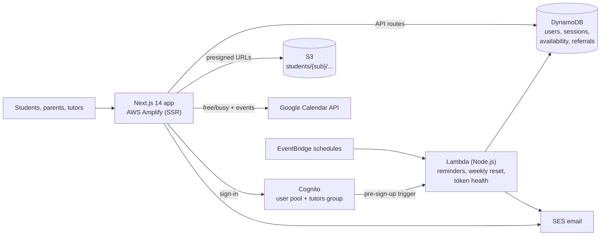

# KLMathPrep

**Live at [klmathprep.com](https://klmathprep.com)**: the platform I built to run my math tutoring business. Students and parents book sessions, upload work, and review notes. Tutors manage availability, write session notes, and get automated reminders. All of it runs serverless on AWS.

## Features

- **Booking:** students pick from open hourly slots. Each slot is the union of every tutor's weekly availability, minus booked sessions and busy times from tutors' Google Calendars. The system assigns the tutor.
- **Session notes & files:** tutors write notes and attach worked material (direct-to-S3 presigned uploads). Students upload homework, scoped to their own S3 prefix.
- **Family accounts:** a parent invites a student by email, and both see one shared household view of sessions, files, credits, and progress.
- **Referrals & credits:** referral links grant free-session credits.
- **Automated email:** confirmations, cancellations, and reminders through SES, driven by scheduled Lambdas.
- **Two-tutor scheduling:** per-tutor availability, meeting rooms, and calendar sync (see [`docs/adr/`](docs/adr) for the design decisions).

## Architecture



| Layer | Tech |
|-------|------|
| Frontend | Next.js 14 (App Router), React, TypeScript, Tailwind CSS |
| Auth | Amazon Cognito: every signed-in API route verifies the caller's token server-side; tutor routes also require the `tutors` group |
| Data | DynamoDB, S3 |
| Jobs & email | EventBridge → Lambda, SES |
| Infra | CloudFormation ([`infrastructure/`](infrastructure)), AWS Amplify hosting |
| Tests | Vitest (`npm test`) |

## Getting Started

### 1. Deploy AWS Infrastructure

```bash
aws cloudformation deploy \
  --template-file infrastructure/cloudformation-template.yaml \
  --stack-name math-tutoring \
  --parameter-overrides TutorEmail=your-email@example.com \
  --capabilities CAPABILITY_IAM
```

### 2. Get the output values

```bash
aws cloudformation describe-stacks --stack-name math-tutoring --query 'Stacks[0].Outputs'
```

### 3. Configure environment

```bash
cp .env.local.example .env.local
# Fill in the values from CloudFormation outputs
```

### 4. Add yourself as a tutor

```bash
aws cognito-idp admin-add-user-to-group \
  --user-pool-id YOUR_POOL_ID \
  --username YOUR_USERNAME \
  --group-name tutors
```

### 5. Verify SES email

```bash
aws ses verify-email-identity --email-address your-email@example.com
```

### 6. Deploy Lambda code

```bash
cd infrastructure/lambda/session-reminder
zip -r function.zip index.mjs
aws lambda update-function-code \
  --function-name math-tutoring-session-reminder \
  --zip-file fileb://function.zip
```

### 7. Run locally

```bash
npm install
npm run dev
```

### 8. Deploy to Amplify

Connect the repo to AWS Amplify. The `amplify.yml` build config is included. Set the environment variables from `.env.local.example` in the Amplify console.

## Pages

| Area | Routes |
|------|--------|
| Public | `/`, `/privacy`, `/auth/*` |
| Students & parents | `/dashboard`, `/book-session`, `/session-history`, `/completed-notes`, `/my-files`, `/progress`, `/family`, `/referrals`, `/survey`, `/settings` |
| Tutors | `/tutor/schedule`, `/tutor/session-notes`, `/tutor/files`, `/tutor/upload` |
